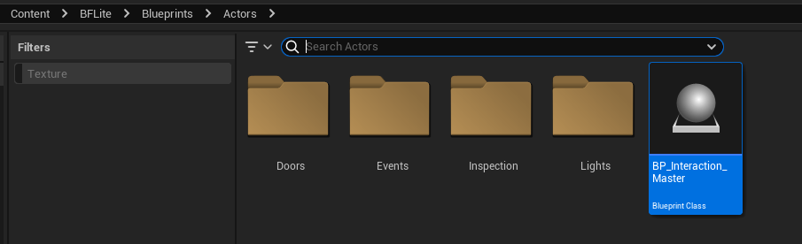
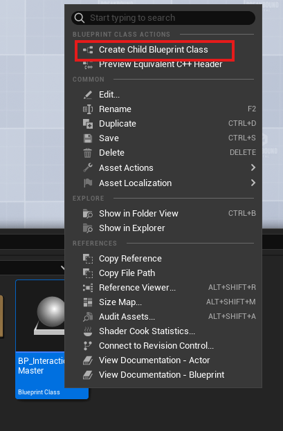
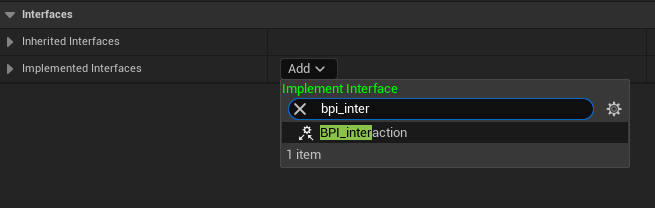
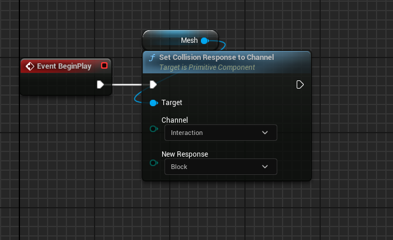
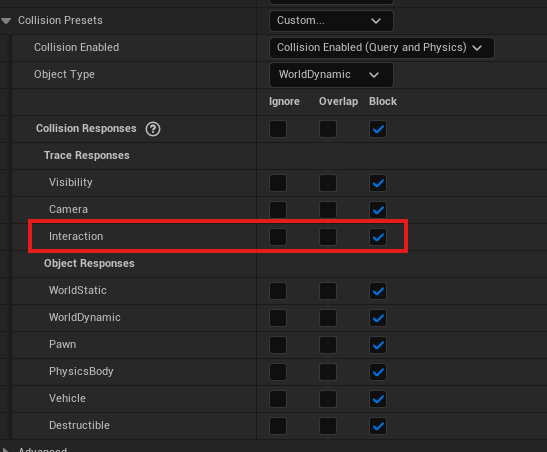

# Interaction System

BFLite includes a modular and flexible interaction system to handle all player interactions like picking up items, opening doors, triggering events, and more.

---

## 🧱 Base Class: `BP_Interaction_Master`

You’ll find this blueprint in:  
📁 `Blueprints/Actors/BP_Interaction_Master`

This actor already has everything wired up for interaction.  
You can **create a child class** from it to start building interactables immediately — no extra setup needed.

---

## 🧩 Creating Your Own Interactable

If you prefer to build something from scratch, here’s what you need:

1. **Create a new Actor**
2. Add the interface: `BPI_Interaction`
3. Implement the `OnInteract` event — this will be called when the player interacts with the object. **And boom, your done **

## 📌 Collision Setup (Important)

To make sure your object can be interacted with, you must enable the correct collision settings, see example above.

---

> 🛑 Don’t forget: this is the core logic hook.  
If you skip `OnInteract`, nothing will happen when the player interacts.