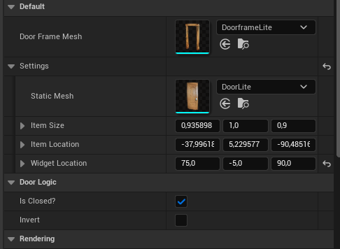
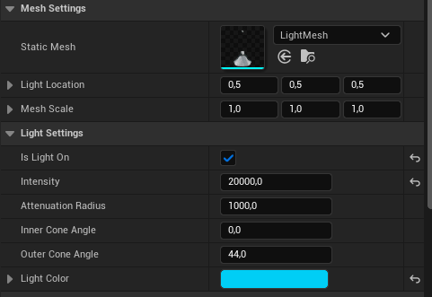
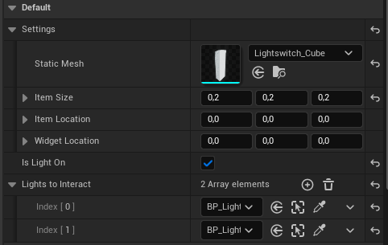

# Door & Light System

BFLite includes a plug-and-play system for interactable doors, lights, and light switches. Everything is handled via exposed variables in the Details panel — no coding required.

---

## 🚪 Doors

1. Drag `BP_Door_Master` into your scene.
2. Build your door frame and mesh by adjusting the **Details panel**.
3. Use the toggles to:
   - Set whether the door starts open or closed
   - Invert rotation direction if needed

📍 You’ll find this actor in:  
📁 `Blueprints/Actors/Doors/BP_Door_Master`

---

## 💡 Lights

1. Drag `BP_Light_Master` into your scene.
2. Tweak intensity, radius, cone angle, mesh, and color directly in the Details panel.
3. Set whether the light starts ON or OFF.

📍 You’ll find this actor in:  
📁 `Blueprints/Actors/Lights/BP_Light_Master`

---

## 🔌 Light Switches

1. Drag `BP_Lightswitch_Master` into the level.
2. Select which **lights it controls** by adding references to the array in the panel.
3. Only `BP_Light_Master` or its **child blueprints** are allowed here.
4. Controll all attached lights with a single switch.

📍 You’ll find this actor in:  
📁 `Blueprints/Actors/Lights/BP_Lightswitch`

> ⚠️ The system is modular. Add multiple lights to a single switch or control each light individually.

---

## 📝 Summary

- All actors are fully adjustable from the **Details Panel**
- Just drag, place, and tweak — no Blueprint editing required
- Perfect for horror games, exploration, and puzzle mechanics

> Need help wiring this with custom triggers? Ask in our [Discord Server](https://discord.gg/K6VmuhcnQM)
