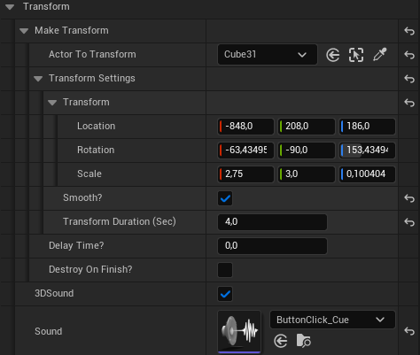
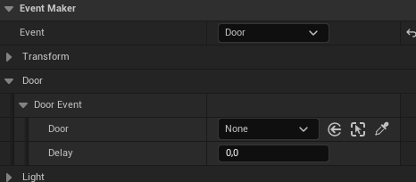
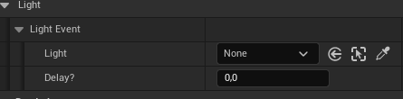

# 🎛️ Event Maker

The Event Maker system allows you to trigger in-game actions such as moving objects, toggling lights, or opening/closing doors — all without writing code.

## 🔘 Event Type Selection

Start by selecting an event type from the dropdown list:

- **Transform** – Move, rotate, or scale any actor
- **Door** – Toggle a door open or closed
- **Lights** – Toggle light actors on or off

---

## 🔁 Transform Event

**What it does:**  
Moves, rotates, or scales any actor you assign.

**Setup Steps:**
- Make sure the actor you are trying to move is set to **Moveable** in the details panel.
- Choose your actor.
- Set the desired **Location**, **Rotation**, and **Scale**.
- Enable `Smooth?` for a gradual animation, or leave it off for instant.
- Set `Transform Duration (Sec)` if smooth is enabled.
- Optionally enable `Destroy on Finish?` if the actor should be removed after.
- Add an optional **2D or 3D sound** to play during the event.

---

## 🚪 Door Event

Toggles a door open or closed.  

- Select your `BP_Door` actor.
- Add a `Delay` if needed.
- Automatically switches state (no need to specify "open" or "close").

---

## 💡 Light Event

Toggles light actors on or off.  

- Select your `BP_Light` actor.
- Add a `Delay` if needed.
- Automatically toggles state based on the current light state.

---

> 🔄 This system is designed to be simple and mistake-proof — no need to manage states manually.
