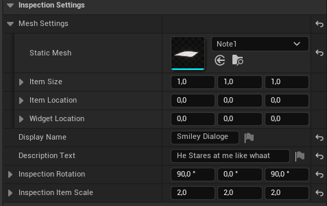

# Inspection System

The inspection system lets players pick up and examine items in 3D with smooth rotation, scaling, and description support — just like you'd expect in modern narrative games.

The demo levels provide 3 examples you can do with this system and you can directly see how its made
---

## 🎬 Getting Started

To use it, simply drag in `BP_Inspection_Master` into your scene.

📁 Path: `Blueprints/Actors/Inspection/BP_Inspection_Master`

No extra setup is required. You configure everything directly in the **Details Panel**.

---

## ⚙️ Customizing the Item

Once placed in your level, all interaction settings are available under the **Inspection Settings** section:

| Setting | Description |
|--------|-------------|
| **Static Mesh** | The item mesh players will rotate/inspect |
| **Item Size** | Controls the mesh's local scale in the world |
| **Item Location** | Adjusts the spawn offset of the item |
| **Widget Location** | Moves the interaction widget location in the world|
| **Display Name** | Name shown in the UI when the player inspects the item |
| **Description Text** | Optional flavor text or lore |
| **Inspection Rotation** | Default rotation when the player starts inspecting |
| **Inspection Item Scale** | Scale applied to the object while in inspection mode |

---

## 💡 Notes

- For note to display text make sure you attached the material to the existing mesh for it to work!

---

> 💬 Questions or custom inspection ideas? Ask in the [Discord Server](https://discord.gg/K6VmuhcnQM)
