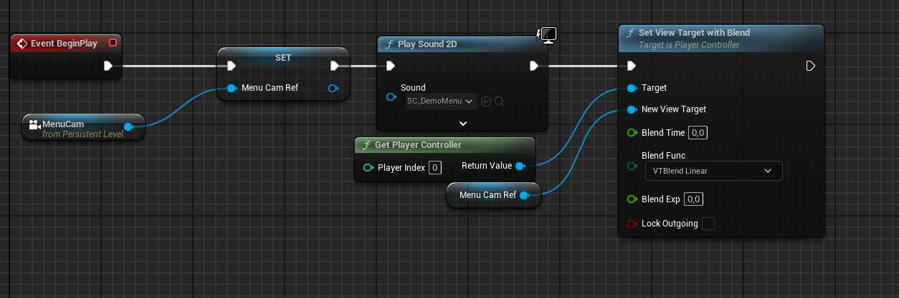

# Menu System

BFLite includes a fully functional **Main Menu system** that loads at the start of the game and saves your settings.  
It is designed to be easy and modular so you can add new settings or rework the menu without too much effort, a video tutorial is in the works to show you all the ins and outs to design the menu other than the provided template

---

## 🧭 Menu Overview

By default, the main menu includes:

- **Start Game**
- **Settings** (currently placeholder, ready for extension)
- **Credits**
- **Quit Game**

The menu is launched automatically when the `Demo_MenuLevel` is loaded.

---

## 🧠 How It Works (Behind the Scenes)

When the menu level loads:

1. A **Menu Camera** is set as the player’s view
2. A **menu sound** is played
3. The `WB_Menu` widget is created and added to the screen
4. The mouse cursor is shown
5. Logic is handled via the custom **Player Controller**: `BP_PC_Menu`

If you use your **own custom level**, make sure to:

- Set the GameMode to `GM_Menu`
- Add this same logic to your level blueprint

---

## 🎮 Custom Controller Support

If you want to use your own **custom Player Controller**, make sure it contains the logic from `BP_PC_Menu`:

- f you use your own controller make sure to add this to the BP_GM_Menu 
- This logic is well-commented and easy to migrate.

---

## 📦 Example: Using Your Own Map

If you’re not using the provided `Demo_MenuLevel`, here’s what you must do:

1. Set **GameMode Override** to `GM_Menu` wich contains all the logic needed to get the menu working
2. Copy the logic you see in the level blueprint to achieve the same result.

---
## 🎨 Customizing the Menu

All widgets are located in:  
📁 `Widgets/Menu`

You can:
- Modify layout and style
- Replace the logo or background
- Add new buttons (like Credits or Continue)
- Change audio or animations

> 📝 Everything is well strcutured for easy access

---

Need help with the setup? [Ask on Discord](https://discord.gg/K6VmuhcnQM)
