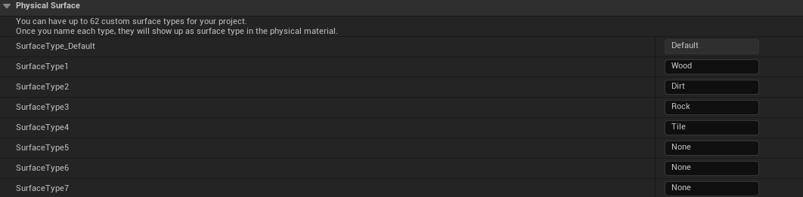
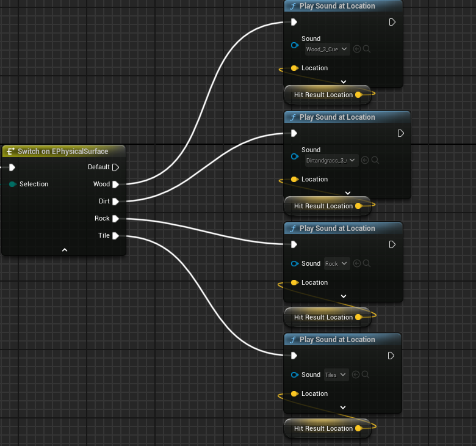

# Footstep Sound System

BFLite uses **physical materials** to determine footstep sounds. This lets you play different sounds when walking on surfaces like wood, metal, grass, and more — all based on Unreal Engine's surface types.

---

## ➕ Adding a New Surface Type

1. Go to **Project Settings → Physics → Physical Surface**  
2. Click the **+** icon and give your new surface a name (e.g., `Snow`, `Carpet`, etc.)

---

## 🧱 Create a Physical Material

1. Go to: `Content/BFLite/Materials/Physical`
2. Create a new **Physical Material** (or duplicate an existing one)
3. In the material details, set the **Surface Type** to your new surface

> 📌 This links your physical material to the trace logic used by footsteps

---

## 🧠 Changes on Character BP

1. Open `BP_Character_Base`
2. Navigate to the function: `FootstepTrace`
3. Right-click on the `EPhysicalSurface` enum and **Refresh Nodes**
4. Find your new surface and **add the correct location and sound**
5. Attach your custom **footstep sound** to the **Play sound at location**

> 💡 You can follow the structure used for existing materials to keep things clean.

---

## ✅ Example Use Case

Want footsteps to crunch in snow or squish in mud?  
Just create the physical material, add a sound, and link it!

---

> 💬 Still unsure? Show your Blueprint or ask for help on the [Discord Server](https://discord.gg/K6VmuhcnQM)
